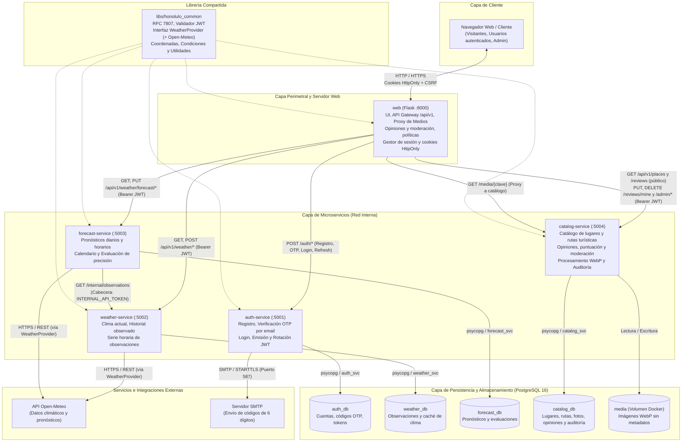

# Honolulo — Monitoreo meteorológico, lugares y cuentas de usuario

Implementación del [`spec.md`](spec.md): microservicios **Flask + PostgreSQL** que muestran el clima actual y el
pronóstico de Honolulo (Tingo María) con calendario según el diseño, **evaluación de la precisión de los pronósticos**,
catálogo de lugares editable por un administrador, **opiniones y puntuación (1 a 5 estrellas) de los visitantes con
moderación del administrador** (fijar o eliminar comentarios) y registro de usuarios con confirmación de correo.

## Arquitectura

El sistema implementa una arquitectura orientada a **microservicios desacoplados** desarrollada con **Flask** y **PostgreSQL 16**, siguiendo el patrón *Database-per-Service*. La superficie de ataque externa está estrictamente delimitada: únicamente el servicio `web` expone puertos al exterior actuando como servidor web y API Gateway, mientras que los microservicios de dominio operan en una red interna privada.

### Diagrama de arquitectura



### Componentes y responsabilidades

| Servicio | Puerto | Responsabilidad | Spec |
|---|---|---|---|
| `web` | 8000 | Pantallas (Jinja2 + Tailwind), pasarela de la API (`/api/v1`), sesión por cookies `HttpOnly`, renovación de tokens, panel de administración, opiniones, políticas de privacidad y de cookies | RF01–RF07 (UI), Esc. 6–8 (UI) |
| `auth-service` | 5001 | Registro (nombre y apellido reales, consentimiento), **código de 6 dígitos enviado por correo al usuario**, política de contraseñas, login, JWT + refresh rotatorio | RF01, Esc. 7 y 8 |
| `weather-service` | 5002 | Clima actual, historial, refresco, serie horaria observada y endpoint interno `/internal/observations` | RF02, RF03, RF06–RF08, RN04, RN08 |
| `forecast-service` | 5003 | Pronósticos (solo inserción), calendario, evaluación y puntuación parametrizable de precisión | RF04, RF05, RF09–RF11 |
| `catalog-service` | 5004 | Lugares (cascadas/rutas), fotos (validadas y re-codificadas a WebP sin metadatos), **opiniones y puntuación**, moderación (fijar/eliminar) y auditoría de cambios | Esc. 6 y opiniones |
| `libs/honolulo_common` | — | Errores RFC 7807 (`application/problem+json`), validación JWT, interfaz de proveedores meteorológicos (Open-Meteo incluido) y utilidades comunes | — |

### Principios y patrones arquitectónicos

1. **Patrón API Gateway y Perímetro Seguro (`web`)**:
   - Es el único punto de entrada público expuesto (`:8000`). **En Docker Compose** los microservicios de backend no publican puertos al host; en desarrollo local (`scripts/dev.py`) escuchan solo en `127.0.0.1`.
   - El cliente se comunica exclusivamente mediante cookies de sesión `HttpOnly` y protección contra CSRF con token dedicado.
   - Aplica el principio de menor privilegio: `web` **no conoce** la clave secreta `JWT_SECRET_KEY`. Su rol es intermediar peticiones, inyectar el token Bearer recibido de `auth-service` hacia los microservicios protegidos y orquestar la rotación transparente de credenciales.

2. **Aislamiento de Persistencia (Database-per-Service)**:
   - Cada microservicio posee su propia base de datos física (`auth_db`, `weather_db`, `forecast_db`, `catalog_db`) con usuarios dedicados en Docker (`auth_svc`, `weather_svc`, etc.) y esquemas independientes (el PostgreSQL embebido de desarrollo usa un único usuario local).
   - No existen claves foráneas ni dependencias directas a nivel de base de datos entre servicios distintos: por ejemplo, las opiniones de `catalog-service` guardan el identificador de la cuenta como texto, sin clave foránea hacia `auth_db`.

3. **Comunicación Inter-Servicio y Seguridad**:
   - Peticiones autenticadas hacia servicios de dominio emplean tokens JWT firmados con algoritmo HS256.
   - La sincronización entre `forecast-service` y `weather-service` (para obtener observaciones reales contra las cuales evaluar la precisión) se realiza vía HTTP interno mediante el endpoint `/internal/observations`, autenticado por una clave precompartida (`INTERNAL_API_TOKEN`). Ninguna clave está escrita en el código: cada servicio las lee del entorno y **no arranca sin secretos fuertes**.

4. **Gestión de Medios y Multimedia**:
   - La carga, validación binaria profunda (inspección de cabeceras mágicas, rechazo de formatos no válidos o metadatos EXIF/GPS) y re-codificación a formato WebP son gestionadas por `catalog-service`.
   - Los archivos se almacenan en un volumen Docker persistente (`media`), y son servidos eficientemente hacia los clientes a través del endpoint de proxy `/media/{clave}` en `web` con cabeceras de caché inmutable y soporte de ETag.

5. **Extensibilidad (SOLID, en especial abierto/cerrado)**:
   - Las variantes se añaden **escribiendo código nuevo, sin editar el que ya funciona**: formas de enviar correo, reglas de contraseña y de comentarios, comandos de desarrollo y proveedores del clima se registran con un decorador y se eligen por configuración.
   - Los puntos de extensión están en la sección [Cómo extender el sistema](#cómo-extender-el-sistema-solid-en-especial-abiertocerrado).

## Cómo ejecutarlo

### Sin Docker (lo probado)

```bash
python -m venv .venv
.venv\Scripts\activate                 # Linux/macOS: source .venv/bin/activate
pip install -r requirements-dev.txt
python scripts/dev.py up               # PostgreSQL embebido + migraciones + 5 servicios
```

Abre <http://127.0.0.1:8000> y crea una cuenta en `/registro`. Sin Internet no hay datos de clima: el sistema no
inventa datos (RN03) y mostrará el aviso de servicio no disponible.

> `dev.py` se niega a arrancar si un puerto está ocupado (evita servidores antiguos sirviendo código desactualizado)
> y al cerrar termina todo el árbol de procesos. **Los secretos no están en el código:** la primera vez genera claves
> aleatorias en `.env.local` (ignorado por git).

**Correo con el código de confirmación (envío real).** Mientras no configures un correo, `dev.py up` trabaja en *modo
archivo*: el mensaje queda en `.mail/` y **no se envía** (lo dice al arrancar). Para que el código llegue al correo con el
que se registra cada persona:

```bash
python scripts/dev.py setup-mail                 # pide tu Gmail y su contraseña de aplicación (la escribes tú; no se muestra)
python scripts/dev.py test-mail tu_correo@gmail.com   # comprueba el envío antes de usarlo
python scripts/dev.py up                         # ahora los códigos salen por correo
```

La contraseña de aplicación se crea en <https://myaccount.google.com/apppasswords> (requiere verificación en dos pasos) y
se guarda solo en `.env.local`. La automatización de QA necesita leer los códigos de `.mail/`, así que se ejecuta con
`python scripts/dev.py up --mail file --no-rate-limit` (sin límite por IP: la QA hace cientos de registros desde una misma IP).

**Administrador** (modera opiniones y edita descripciones y fotos de los lugares en `/admin/lugares`):

```bash
python scripts/dev.py create-admin               # crea uno nuevo (pide nombre, apellido y contraseña sin mostrarla)
python scripts/dev.py set-role <correo> admin    # o promueve una cuenta existente (con `user` la degrada)
```

### Con Docker Compose

```bash
cp .env.example .env                   # completar secretos, contraseñas y el SMTP (ver abajo)
docker compose up --build              # http://localhost:8000
```

> Los `Dockerfile` y `docker-compose.yml` se escribieron y se validó su sintaxis, pero **no se construyeron** en el
> equipo de desarrollo (no tenía Docker). Conviene un primer `docker compose up --build` de prueba.

**Correo real (código de confirmación).** En producción `MAIL_BACKEND=smtp`. Con Gmail: `SMTP_HOST=smtp.gmail.com`,
`SMTP_PORT=587`, `SMTP_USER=tu_cuenta@gmail.com` y `SMTP_PASSWORD` = una **contraseña de aplicación** de Google
(requiere verificación en dos pasos; no la contraseña normal).

## Pruebas

```bash
python scripts/run_tests.py            # revisión de secretos + 735 pruebas: común 120 · auth 143 · weather 30 · forecast 88 · catalog 179 · web 175
python scripts/dev.py up --mail file --no-rate-limit   # (otra terminal) el sistema para la QA de extremo a extremo
cd qa && python -m pytest -q           # 175 pruebas de QA de extremo a extremo contra el sistema corriendo
```

Las suites usan **PostgreSQL real** (no SQLite): `TEST_DATABASE_URL` si existe, o uno embebido con `pgserver`. Las
unitarias simulan el proveedor externo; las de `qa/` no usan mocks. Ver el **[informe de QA](qa/QA-REPORT.md)**
(estrategia, trazabilidad con el spec, 8 defectos corregidos y lo que queda por probar).

## Lo que implementa cada escenario nuevo

- **Esc. 6 — administrador:** `/admin/lugares` (solo rol `admin`) edita nombre, descripción, datos de la ruta y estado, y
  sube/elimina fotos y elige la portada. Las fotos se validan por contenido (no por extensión), se re-codifican a WebP
  sin metadatos (EXIF/GPS), con límites de tamaño y de píxeles; cada cambio queda en el historial con autor. El
  visitante ve los lugares en la pantalla principal.
- **Esc. 7 — correo con código y consentimiento:** el registro crea la cuenta sin sesión; se envía un código de 6 dígitos
  (vence en 10 min, 5 intentos, reenvío cada 60 s y máx. 5 por hora) y solo al confirmarlo se inicia la sesión. Es
  obligatorio aceptar la política de privacidad (`/politica-de-privacidad`); se guarda la fecha y la versión. Las
  direcciones de Gmail se normalizan (puntos y `+etiqueta`) para no duplicar cuentas. **No** hay «Iniciar sesión con
  Google» (OAuth): «cuentas de Gmail» se interpretó como correos confirmados por código.
- **Esc. 8 — datos reales:** nombre y apellido obligatorios y validados (se rechazan «Test», «aaaa», dígitos, etc.).
  No se puede verificar que un nombre sea real; la titularidad del correo sí se comprueba con el código.

## Opiniones, moderación, políticas y seguridad

- **Opiniones y puntuación.** En cada cascada, el botón «Opiniones y puntuación» abre una ventana con el promedio,
  la distribución por estrellas, el formulario (1–5 estrellas + comentario opcional de hasta 1000 caracteres) y la lista.
  **Una opinión por persona y lugar** (se edita o se elimina, no se acumula); pública solo con «Nombre I.» (nunca el
  correo ni el apellido completo). No se permiten enlaces; se limpian caracteres de control y de dirección invisibles; el
  texto siempre se muestra escapado. *Se aplica a todas las cascadas del catálogo; «Marulla» no existe en él: el
  administrador puede crearla desde `/admin/lugares/nuevo`.*
- **Rol de administrador** (ya existía; ahora también modera): **fija** hasta 3 opiniones por lugar (aparecen primero) o
  las **elimina**, desde la propia ventana pública o desde `/admin/lugares/<lugar>` (sección «Opiniones»). Cada acción
  queda en el historial con quién la hizo, **sin conservar el texto eliminado**. Si el autor edita el texto de una
  opinión fijada, deja de estar fijada. Además sigue cambiando fotos y descripciones.
- **Políticas.** `/politica-de-privacidad` (reescrita: opiniones, correo, seguridad, moderación, retención y derechos
  ARCO) y `/politica-de-cookies` (tabla de las 4 cookies reales, todas esenciales; sin analítica ni publicidad), más un
  aviso informativo y descartable. La versión vigente es **2026-10-04** y se guarda con cada consentimiento. Siguen
  siendo textos base: **requieren revisión legal**; y `CONTACT_EMAIL` debe cambiarse por un correo real.
- **Seguridad.** Ninguna contraseña ni clave en el código (`scripts/check_secrets.py` lo vigila y corre con las pruebas);
  los servicios **no arrancan sin secretos fuertes**; la contraseña del usuario solo existe como hash con sal (nunca en
  código, registros ni correos); mínimo 10 caracteres, sin contraseñas comunes ni que contengan el nombre o el correo;
  el administrador se crea con una contraseña oculta que cumple la misma política; cabeceras `Content-Security-Policy`
  (marcos, `<base>`, formularios), `Permissions-Policy`, `COOP` y HSTS en HTTPS; `COOKIE_SECURE` activo por defecto en
  producción.
- **Límite de peticiones por IP** (en la web, que es la única puerta de entrada): 10 intentos de ingreso cada 5 min, 10
  registros cada 30 min, 15 intentos con el código cada 10 min, 5 reenvíos de código cada 10 min, 20 cambios de opiniones
  cada 10 min y 300 peticiones por minuto en total (los archivos estáticos y las fotos no cuentan). Responde `429` con
  `Retry-After` (página en español para el navegador y `problem+json` para la API). `X-Forwarded-For` **se ignora** salvo que
  se declare un proxy de confianza (`TRUSTED_PROXY_HOPS=1`), porque cualquiera podría falsificarlo. Es en memoria (la web
  usa un solo worker): con varios procesos haría falta un almacén compartido (la clase se cambia sin tocar las reglas).
- **Auditoría de seguridad** (`auth`): cada registro, confirmación de correo, ingreso correcto o fallido, bloqueo de cuenta,
  cierre de sesión, token de sesión reutilizado (posible robo) y cambio de rol queda con fecha, IP y solo una pista del
  correo (`a***@gmail.com`) más una huella con clave; nunca contraseñas ni códigos. Los administradores la ven en
  `/admin/seguridad` (filtro por tipo de evento) y en la terminal con `flask audit-list`; se conserva 180 días
  (`flask purge-audit`).
- **Dependencias:** `requirements-lock.txt` fija las versiones probadas (los Dockerfile instalan con `-c`), no hay paquetes
  declarados que no se usen (lo vigila una prueba), `.dockerignore` deja fuera secretos y datos locales de las imágenes y
  Dependabot propone las actualizaciones cada semana. `pip-audit` no encuentra vulnerabilidades conocidas.

## Resistencia a abusos y pruebas de estrés

`scripts/stress.py` mide el sistema **local** (solo acepta `127.0.0.1`: no sirve para atacar servidores ajenos). Cada escenario
mide también a una persona normal que entra desde otra IP, porque lo importante no es solo si el sistema aguanta, sino si
**una persona abusadora perjudica a las demás**.

```bash
python scripts/dev.py up --no-rate-limit          # capacidad real (sin el límite por IP)
python scripts/stress.py baseline                 # latencia en calma
python scripts/stress.py read-flood --concurrency 100 --duration 15
python scripts/stress.py ramp                     # sube de 10 a 400 conexiones para ver dónde se degrada
python scripts/stress.py login-flood              # intentos de ingreso en masa (cada uno calcula un hash scrypt)
python scripts/stress.py slow-connections         # cientos de conexiones lentas abiertas
python scripts/stress.py oversize                 # cuerpos, direcciones y cabeceras gigantes
python scripts/stress.py recovery                 # ¿vuelve a la normalidad?
# el límite por IP en acción (otra IP para la persona normal):  TRUSTED_PROXY_HOPS=1 python scripts/dev.py up
```

Medido en Windows con el servidor de desarrollo de Flask (cifras de referencia: varían con la carga del equipo):

| Prueba | Resultado |
|---|---|
| Una persona, 100 conexiones a la vez, **con** el límite por IP | De 5 641 peticiones se atendieron 300 (el límite por minuto) y 5 341 recibieron `429`. La persona normal no se vio afectada y ningún servicio se cayó. |
| Lecturas **sin** límite, 50 conexiones | ≈ 215 peticiones/s sin errores; la persona normal pasa de ~30 ms a ~240 ms. |
| Lecturas sin límite, 100 o más conexiones | Aparecen errores: el servidor de desarrollo cierra la conexión tras cada respuesta y el equipo se queda sin puertos locales. Ningún servicio se cae y todo responde de nuevo a los pocos segundos. |
| Ingreso masivo **sin** límite, 30 conexiones | ≈ 40 intentos/s (cada uno calcula un hash scrypt): la persona normal pasa de ~30 ms a ~500 ms. Con el límite: 10 intentos cada 5 min por IP. |
| 300 conexiones lentas abiertas | La persona normal no se ve afectada, pero el servidor de desarrollo las tolera indefinidamente (ver abajo). |
| Cuerpo de 1, 7 y 40 MB, dirección de 100 000 caracteres, 500 cabeceras | Rechazados al instante (`413`, `414`, `431`). |
| Después de toda la carga | Todos los servicios responden; memoria 378 → 391 MB (sin fugas). |

**Qué se corrigió.** La web llamaba a los demás servicios con `requests.request(...)`, que abre una conexión nueva en cada
llamada y deja un puerto local ocupado durante minutos: a unos cientos de llamadas por segundo esos puertos se agotan y la web
deja de hablar con el resto aunque ninguno esté caído. Ahora usa una sesión compartida con *pool* de conexiones
(`honolulo_common/http_client.py`): sin cookies (no se mezclan entre personas), repite una vez las lecturas si el servidor cerró
la conexión justo antes y nunca repite escrituras. Comparado de forma directa contra un servidor que reutiliza conexiones, cada
llamada interna pasa de ≈ 5–6 ms a ≈ 3 ms y se abren 1–7 conexiones en lugar de 800–1 200. Además, el tiempo para conectar con
un servicio es de 3 s (`UPSTREAM_CONNECT_TIMEOUT_S`), aparte de los 12 s para esperar la respuesta: un servicio caído libera el
hilo enseguida.

**Qué no se pudo comprobar aquí y conviene resolver al publicar** (gunicorn no funciona en Windows y las imágenes de Docker no
se construyeron):

- **Conexiones lentas («slowloris»).** Con `gunicorn -w 1 --threads 8`, unas pocas conexiones que envían la petición a
  cuentagotas podrían dejar a la web sin hilos libres. Se resuelve con un proxy delante (nginx, Caddy o el de la plataforma)
  que corte las conexiones lentas (`client_header_timeout`, `client_body_timeout`), limite conexiones por IP (`limit_conn`),
  peticiones por segundo (`limit_req`) y el tamaño del cuerpo (`client_max_body_size`). Es la recomendación habitual y
  **no está probada aquí**.
- **Hilos de la web.** Cada petición que pasa por la web retiene un hilo mientras espera al servicio interno: con 8 hilos, un
  servicio lento puede ocuparlos todos hasta 12 s. Conviene subir `--threads` (la web casi solo espera) y vigilar los tiempos.
- **El límite por IP no frena un ataque distribuido** (muchas IP a la vez) y vive en la memoria de un solo proceso. Para eso
  hace falta protección en el borde (CDN o WAF) y, con varios procesos, un almacén compartido (ver «Cómo extender»).

## API

La web expone el contrato del spec en `/api/v1/…`; todo el módulo meteorológico exige sesión (RF01 → `401`).

| Método y ruta | Servicio | Spec |
|---|---|---|
| `GET /api/v1/weather/current` · `POST …/refresh` · `GET …/history` · `…/location` · `…/status` | weather (+forecast en `refresh`) | RF02–RF08 |
| `GET /api/v1/weather/forecast?date=` · `…/calendar?month=` | forecast | RF04, RF05, RF09 |
| `GET /api/v1/weather/evaluation/{forecast_id}` · `…/evaluation?date=` | forecast | RF10, RF11, RN06, RN07 |
| `GET·PUT /api/v1/weather/scoring-parameters` | forecast | RF11 (PUT solo `admin`) |
| `GET /api/v1/places[/{slug}]` · `GET /media/{clave}` | catalog (público; incluye `rating`) | Esc. 6 |
| `GET /api/v1/places/{slug}/reviews?limit=&offset=` | catalog (público, sin caché) | Opiniones |
| `GET·PUT·DELETE /api/v1/places/{slug}/reviews/mine` | catalog (sesión) | Mi opinión |
| `PUT /api/v1/reviews/{id}/pin` · `DELETE /api/v1/reviews/{id}` | catalog (solo `admin`) | Moderación |
| `POST /auth/register · verify-email · resend-code · login · refresh · logout`, `GET /auth/me` | auth (directo) | Esc. 7 y 8 |

Los contratos de `current`, `forecast` y `evaluation` conservan los campos del spec y solo añaden campos.
Errores en `application/problem+json`.

## Comportamiento que conviene conocer

- **Ubicación única** (RN01/RN02): Honolulo, con coordenadas configurables (`LOCATION_LAT/LON`). El valor por defecto
  es el de Tingo María (9°17′44″S 75°59′51″O): **debe reemplazarse por el del predio**.
- **Proveedor**: Open-Meteo (sin API key) tras `honolulo_common/openmeteo.py`. **Verifique sus términos comerciales**
  (el plan gratuito es para uso no comercial). Durante las pruebas devolvió un HTTP 503 real y el sistema respondió
  como exige el spec (RN08: último dato guardado marcado como anterior + mensaje estándar).
- **Calendario**: solo días con pronóstico guardado (el proveedor llega a ~16 días); el resto queda con «—» (RN03).
- **Evaluación** (RN06): se compara con la **serie horaria** del proveedor para esa hora, usando el último pronóstico
  emitido al menos 24 h antes (o el último previo a la hora); sin observación → «Pronóstico pendiente de evaluación.»
  Fórmula por defecto (parámetro del sistema, versionada): `score = 100·Σ(wᵢ·sᵢ)/Σ(wᵢ)` con pesos temperatura 0,25 ·
  lluvia 0,25 · humedad 0,15 · condición 0,15 · precipitación 0,10 · viento 0,10. Etiquetas: ≥ 90 «Muy buena precisión»
  · ≥ 75 «Buena» · ≥ 60 «Aceptable» · menor «Baja».
- Tras editar un lugar, los visitantes pueden ver el texto anterior hasta 30 s (caché pública corta).

## Cómo extender el sistema (SOLID, en especial abierto/cerrado)

El código se organiza para **añadir variantes escribiendo código nuevo, no editando el que ya funciona**. Los puntos de
extensión (cada uno tiene pruebas que lo demuestran, `test_extensibility.py` y similares):

| Quiero añadir… | Cómo | Dónde |
|---|---|---|
| Otra forma de enviar correo (API de un proveedor, una cola…) | función con `@register_backend("nombre", external=...)` y `MAIL_BACKEND=nombre` | `services/auth/app/mailer.py` |
| Otra forma de conectar por SMTP | función con `@register_smtp_security("nombre")` | `services/auth/app/mailer.py` |
| Otro texto de correo | nueva función constructora | `services/auth/app/mail_templates.py` |
| Una regla de contraseña (p. ej. lista de claves filtradas) | función con `@password_rule` | `services/auth/app/passwords.py` |
| Una norma para los comentarios (p. ej. filtro de insultos) o un saneador | función con `@comment_rule` / `@comment_sanitizer` | `services/catalog/app/review_schemas.py` |
| Un comando de desarrollo | función con `@command("nombre", ...)` | `scripts/dev.py` |
| Una acción en la ventana de opiniones | entrada en la tabla `ACTIONS` + botón con `data-action` | `services/web/app/static/js/reviews.js` |
| Una regla de límite de peticiones | `Rule` en `default_rules()` (o `limiter.add(Rule(...))`) | `services/web/app/ratelimit.py` |
| Otro almacén del límite (p. ej. Redis, con varios procesos) | clase con el método `hit(clave, límite, ventana)` | `services/web/app/ratelimit.py` |
| Un tipo de evento de seguridad | miembro nuevo de `Event` y una llamada `audit.record(...)` | `services/auth/app/audit.py` |
| Un escenario de prueba de estrés | función con `@scenario("nombre", "ayuda")` | `scripts/stress.py` |
| Un patrón de secreto a vigilar | entrada en `RULES` | `scripts/check_secrets.py` |
| Otro proveedor del clima | clase que cumpla `WeatherProvider` + `@register_provider("nombre")`, y `WEATHER_PROVIDER=nombre` (con `WEATHER_PROVIDER_MODULES=mi.modulo` si no está incluido); `weather` y `forecast` no cambian | `libs/honolulo_common/honolulo_common/weather_provider.py` (interfaz y registro), `openmeteo.py` (ejemplo) |

Responsabilidad única: cada módulo tiene un motivo para cambiar (p. ej. en el catálogo, `service.py` = lugares y fotos,
`reviews.py` = opiniones sin depender de HTTP, `reviews_api.py` = rutas, `review_schemas.py` = validación del texto;
en la web, `reviews_api.py` y `admin_reviews.py` separados de la pasarela del clima y de la edición de lugares).

## Limitaciones conocidas y decisiones

- **«Observación real» = análisis horario del proveedor**, no una estación en el sitio.
- **JWT HS256 con secreto compartido** entre `auth`, `weather`, `forecast` y `catalog` (la web no lo conoce); el paso
  natural es RS256 + JWKS. Un access token dura 15 min (no se revoca al cerrar sesión; el refresh sí).
- **Scheduler en proceso**: `weather` y `forecast` corren con **un solo worker** para no duplicar consultas al proveedor.
- **Web con un worker**: la renovación de tokens rotatorios se coordina en memoria; con varios procesos haría falta
  afinidad de sesión o un almacén compartido.
- **Fotos en disco** (volumen `media`); la interfaz `storage.py` permite pasar a S3.
- **Tailwind por CDN** y fuentes de Google, como en el diseño; para producción conviene compilar y autoalojar.
- **Política de privacidad**: texto base que requiere revisión legal.
- **Límite por IP en memoria:** protege a la web de una persona abusadora (ver «Resistencia a abusos»), pero no de un ataque
  distribuido, y no se comparte entre varios procesos. El bloqueo de cuenta tras 5 fallos sigue activo.
- **Límite por IP y auditoría:** la IP que ve `auth` es la que le reenvía la web (`X-Client-IP`); si se publica detrás de un
  proxy hay que declararlo (`TRUSTED_PROXY_HOPS`) o todas las personas parecerán la misma IP. Los eventos de seguridad
  guardan la IP (dato personal): la política de privacidad lo dice y fija 180 días.
- **Dependencias:** el lock se generó con Python 3.11 y se comprobó que cada versión fijada tiene rueda para Python 3.12 en
  Linux (la imagen de Docker), pero las imágenes no se construyeron aquí. Para actualizar: `python scripts/freeze_lock.py`
  y correr las pruebas.
- **El envío real de correo se probó contra un servidor SMTP local de pruebas**, no contra Gmail (sin credenciales en el
  entorno de desarrollo): ejecuta `dev.py test-mail` con tu cuenta antes de depender de él. El envío es síncrono.
- Las personas que ya tenían cuenta aceptaron una versión anterior de la política; el sistema aún no les pide
  aceptar la nueva (la versión queda registrada por cuenta, por si se quiere exigir).
- Los comentarios se moderan **después** de publicarse (no hay cola previa) y no hay filtro de insultos: solo bloqueo
  de enlaces y la moderación del administrador. La cancelación de cuentas se atiende por correo (no hay botón).
- Fuera de alcance: reservas y contacto por WhatsApp del diseño, pagos, «Iniciar sesión con Google».

## Estructura

```
libs/honolulo_common/        errores, JWT, openmeteo, conditions, timeutil, testing
services/{auth,weather,forecast,catalog,web}/   app/ · migrations/ · tests/ · Dockerfile
qa/                          pruebas de QA de extremo a extremo + QA-REPORT.md
infra/postgres/init/         crea una base y un rol por servicio (Docker)
scripts/dev.py               entorno local sin Docker (+ setup-mail, test-mail, create-admin, set-role)
scripts/devenv.py            lee y genera .env.local (secretos aleatorios; fuera de git)
scripts/check_secrets.py     falla si hay contraseñas o claves escritas en el código
scripts/freeze_lock.py       regenera requirements-lock.txt (versiones exactas probadas)
scripts/stress.py            pruebas de estrés del sistema local (solo 127.0.0.1)
scripts/run_tests.py         revisión de secretos + todas las suites
```
