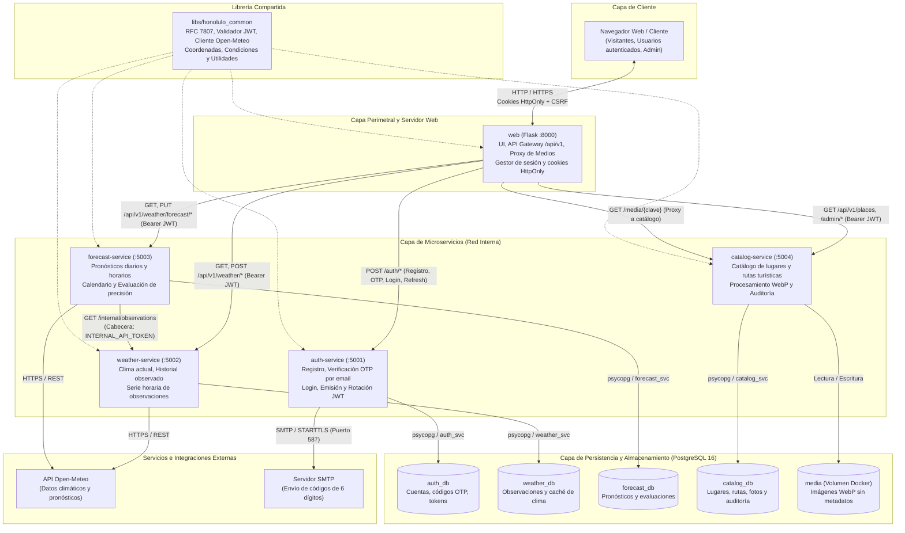

# Honolulo — Monitoreo meteorológico, lugares y cuentas de usuario

Implementación del [`spec.md`](spec.md): microservicios **Flask + PostgreSQL** que muestran el clima actual y el
pronóstico de Honolulo (Tingo María) con calendario según el diseño, **evaluación de la precisión de los pronósticos**,
catálogo de lugares editable por un administrador y registro de usuarios con confirmación de correo.

## Arquitectura

El sistema implementa una arquitectura orientada a **microservicios desacoplados** desarrollada con **Flask** y **PostgreSQL 16**, siguiendo el patrón *Database-per-Service*. La superficie de ataque externa está estrictamente delimitada: únicamente el servicio `web` expone puertos al exterior actuando como servidor web y API Gateway, mientras que los microservicios de dominio operan en una red interna privada.

### Diagrama de arquitectura



### Componentes y responsabilidades

| Servicio | Puerto | Responsabilidad | Spec |
|---|---|---|---|
| `web` | 8000 | Pantallas (Jinja2 + Tailwind), pasarela de la API (`/api/v1`), sesión por cookies `HttpOnly`, renovación de tokens y panel de administración | RF01–RF07 (UI), Esc. 6–8 (UI) |
| `auth-service` | 5001 | Registro (nombre y apellido reales, consentimiento), **código de 6 dígitos por correo**, login, JWT + refresh rotatorio | RF01, Esc. 7 y 8 |
| `weather-service` | 5002 | Clima actual, historial, refresco, serie horaria observada y endpoint interno `/internal/observations` | RF02, RF03, RF06–RF08, RN04, RN08 |
| `forecast-service` | 5003 | Pronósticos (solo inserción), calendario, evaluación y puntuación parametrizable de precisión | RF04, RF05, RF09–RF11 |
| `catalog-service` | 5004 | Lugares (cascadas/rutas), fotos (validadas y re-codificadas a WebP sin metadatos) y auditoría de cambios | Esc. 6 |
| `libs/honolulo_common` | — | Errores RFC 7807 (`application/problem+json`), validación JWT, cliente Open-Meteo y utilidades comunes | — |

### Principios y patrones arquitectónicos

1. **Patrón API Gateway y Perímetro Seguro (`web`)**:
   - Es el único punto de entrada público expuesto (`:8000`). Los microservicios de backend no exponen puertos al host.
   - El cliente se comunica exclusivamente mediante cookies de sesión `HttpOnly` y protección contra CSRF con token dedicado.
   - Aplica el principio de menor privilegio: `web` **no conoce** la clave secreta `JWT_SECRET_KEY`. Su rol es intermediar peticiones, inyectar el token Bearer recibido de `auth-service` hacia los microservicios protegidos y orquestar la rotación transparente de credenciales.

2. **Aislamiento de Persistencia (Database-per-Service)**:
   - Cada microservicio posee su propia base de datos física (`auth_db`, `weather_db`, `forecast_db`, `catalog_db`) con usuarios dedicados (`auth_svc`, `weather_svc`, etc.) y esquemas independientes.
   - No existen claves foráneas ni dependencias directas a nivel de base de datos entre servicios distintos.

3. **Comunicación Inter-Servicio y Seguridad**:
   - Peticiones autenticadas hacia servicios de dominio emplean tokens JWT firmados con algoritmo HS256.
   - La sincronización entre `forecast-service` y `weather-service` (para obtener observaciones reales contra las cuales evaluar la precisión) se realiza vía HTTP interno mediante el endpoint `/internal/observations`, autenticado por una clave precompartida (`INTERNAL_API_TOKEN`).

4. **Gestión de Medios y Multimedia**:
   - La carga, validación binaria profunda (inspección de cabeceras mágicas, rechazo de formatos no válidos o metadatos EXIF/GPS) y re-codificación a formato WebP son gestionadas por `catalog-service`.
   - Los archivos se almacenan en un volumen Docker persistente (`media`), y son servidos eficientemente hacia los clientes a través del endpoint de proxy `/media/{clave}` en `web` con cabeceras de caché inmutable y soporte de ETag.

## Cómo ejecutarlo

### Sin Docker (lo probado)

```bash
python -m venv .venv
.venv\Scripts\activate                 # Linux/macOS: source .venv/bin/activate
pip install -r requirements-dev.txt
python scripts/dev.py up               # PostgreSQL embebido + migraciones + 5 servicios
```

Abre <http://127.0.0.1:8000> y crea una cuenta en `/registro`. **En desarrollo el correo no se envía: el mensaje con el
código queda en la carpeta `.mail/`** (un archivo por correo). Sin Internet no hay datos de clima: el sistema no inventa
datos (RN03) y mostrará el aviso de servicio no disponible.

> `dev.py` se niega a arrancar si un puerto está ocupado (evita servidores antiguos sirviendo código desactualizado)
> y al cerrar termina todo el árbol de procesos.

**Cuenta de administrador** (puede editar descripciones y fotos de los lugares en `/admin/lugares`):

```bash
cd services/auth
python -m flask --app app:create_app create-admin            # crea una nueva
python -m flask --app app:create_app set-role <correo> admin # o promueve una existente
```

(con `DATABASE_URL` apuntando a `auth_db`: la URI base del PostgreSQL embebido la imprime `dev.py` al arrancar).

### Con Docker Compose

```bash
cp .env.example .env                   # completar secretos, contraseñas y el SMTP (ver abajo)
docker compose up --build              # http://localhost:8000
```

> Los `Dockerfile` y `docker-compose.yml` se escribieron y se validó su sintaxis, pero **no se construyeron** en el
> equipo de desarrollo (no tenía Docker). Conviene un primer `docker compose up --build` de prueba.

**Correo real (código de confirmación).** En producción `MAIL_BACKEND=smtp`. Con Gmail: `SMTP_HOST=smtp.gmail.com`,
`SMTP_PORT=587`, `SMTP_USER=tu_cuenta@gmail.com` y `SMTP_PASSWORD` = una **contraseña de aplicación** de Google
(requiere verificación en dos pasos; no la contraseña normal).

## Pruebas

```bash
python scripts/run_tests.py            # 412 pruebas: común 25 · auth 87 · weather 27 · forecast 85 · catalog 92 · web 96
cd qa && python -m pytest -q           # 118 pruebas de QA de extremo a extremo (requieren el sistema corriendo)
```

Las suites usan **PostgreSQL real** (no SQLite): `TEST_DATABASE_URL` si existe, o uno embebido con `pgserver`. Las
unitarias simulan el proveedor externo; las de `qa/` no usan mocks. Ver el **[informe de QA](qa/QA-REPORT.md)**
(estrategia, trazabilidad con el spec, 8 defectos corregidos y lo que queda por probar).

## Lo que implementa cada escenario nuevo

- **Esc. 6 — administrador:** `/admin/lugares` (solo rol `admin`) edita nombre, descripción, datos de la ruta y estado, y
  sube/elimina fotos y elige la portada. Las fotos se validan por contenido (no por extensión), se re-codifican a WebP
  sin metadatos (EXIF/GPS), con límites de tamaño y de píxeles; cada cambio queda en el historial con autor. El
  visitante ve los lugares en la pantalla principal.
- **Esc. 7 — correo con código y consentimiento:** el registro crea la cuenta sin sesión; se envía un código de 6 dígitos
  (vence en 10 min, 5 intentos, reenvío cada 60 s y máx. 5 por hora) y solo al confirmarlo se inicia la sesión. Es
  obligatorio aceptar la política de privacidad (`/politica-de-privacidad`); se guarda la fecha y la versión. Las
  direcciones de Gmail se normalizan (puntos y `+etiqueta`) para no duplicar cuentas. **No** hay «Iniciar sesión con
  Google» (OAuth): «cuentas de Gmail» se interpretó como correos confirmados por código.
- **Esc. 8 — datos reales:** nombre y apellido obligatorios y validados (se rechazan «Test», «aaaa», dígitos, etc.).
  No se puede verificar que un nombre sea real; la titularidad del correo sí se comprueba con el código.

## API

La web expone el contrato del spec en `/api/v1/…`; todo el módulo meteorológico exige sesión (RF01 → `401`).

| Método y ruta | Servicio | Spec |
|---|---|---|
| `GET /api/v1/weather/current` · `POST …/refresh` · `GET …/history` · `…/location` · `…/status` | weather (+forecast en `refresh`) | RF02–RF08 |
| `GET /api/v1/weather/forecast?date=` · `…/calendar?month=` | forecast | RF04, RF05, RF09 |
| `GET /api/v1/weather/evaluation/{forecast_id}` · `…/evaluation?date=` | forecast | RF10, RF11, RN06, RN07 |
| `GET·PUT /api/v1/weather/scoring-parameters` | forecast | RF11 (PUT solo `admin`) |
| `GET /api/v1/places[/{slug}]` · `GET /media/{clave}` | catalog (público) | Esc. 6 |
| `POST /auth/register · verify-email · resend-code · login · refresh · logout`, `GET /auth/me` | auth (directo) | Esc. 7 y 8 |

Los contratos de `current`, `forecast` y `evaluation` conservan los campos del spec y solo añaden campos.
Errores en `application/problem+json`.

## Comportamiento que conviene conocer

- **Ubicación única** (RN01/RN02): Honolulo, con coordenadas configurables (`LOCATION_LAT/LON`). El valor por defecto
  es el de Tingo María (9°17′44″S 75°59′51″O): **debe reemplazarse por el del predio**.
- **Proveedor**: Open-Meteo (sin API key) tras `honolulo_common/openmeteo.py`. **Verifique sus términos comerciales**
  (el plan gratuito es para uso no comercial). Durante las pruebas devolvió un HTTP 503 real y el sistema respondió
  como exige el spec (RN08: último dato guardado marcado como anterior + mensaje estándar).
- **Calendario**: solo días con pronóstico guardado (el proveedor llega a ~16 días); el resto queda con «—» (RN03).
- **Evaluación** (RN06): se compara con la **serie horaria** del proveedor para esa hora, usando el último pronóstico
  emitido al menos 24 h antes (o el último previo a la hora); sin observación → «Pronóstico pendiente de evaluación.»
  Fórmula por defecto (parámetro del sistema, versionada): `score = 100·Σ(wᵢ·sᵢ)/Σ(wᵢ)` con pesos temperatura 0,25 ·
  lluvia 0,25 · humedad 0,15 · condición 0,15 · precipitación 0,10 · viento 0,10. Etiquetas: ≥ 90 «Muy buena precisión»
  · ≥ 75 «Buena» · ≥ 60 «Aceptable» · menor «Baja».
- Tras editar un lugar, los visitantes pueden ver el texto anterior hasta 30 s (caché pública corta).

## Limitaciones conocidas y decisiones

- **«Observación real» = análisis horario del proveedor**, no una estación en el sitio.
- **JWT HS256 con secreto compartido** entre `auth`, `weather`, `forecast` y `catalog` (la web no lo conoce); el paso
  natural es RS256 + JWKS. Un access token dura 15 min (no se revoca al cerrar sesión; el refresh sí).
- **Scheduler en proceso**: `weather` y `forecast` corren con **un solo worker** para no duplicar consultas al proveedor.
- **Web con un worker**: la renovación de tokens rotatorios se coordina en memoria; con varios procesos haría falta
  afinidad de sesión o un almacén compartido.
- **Fotos en disco** (volumen `media`); la interfaz `storage.py` permite pasar a S3.
- **Tailwind por CDN** y fuentes de Google, como en el diseño; para producción conviene compilar y autoalojar.
- **Política de privacidad**: texto base que requiere revisión legal.
- Sin limitación de intentos por IP en el login (sí bloqueo de cuenta tras 5 fallos): usar un *rate limiter* en el proxy.
- Fuera de alcance: reservas y contacto por WhatsApp del diseño, pagos, «Iniciar sesión con Google».

## Estructura

```
libs/honolulo_common/        errores, JWT, openmeteo, conditions, timeutil, testing
services/{auth,weather,forecast,catalog,web}/   app/ · migrations/ · tests/ · Dockerfile
qa/                          pruebas de QA de extremo a extremo + QA-REPORT.md
infra/postgres/init/         crea una base y un rol por servicio (Docker)
scripts/dev.py               entorno local sin Docker · scripts/run_tests.py
```
